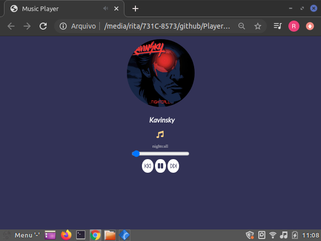
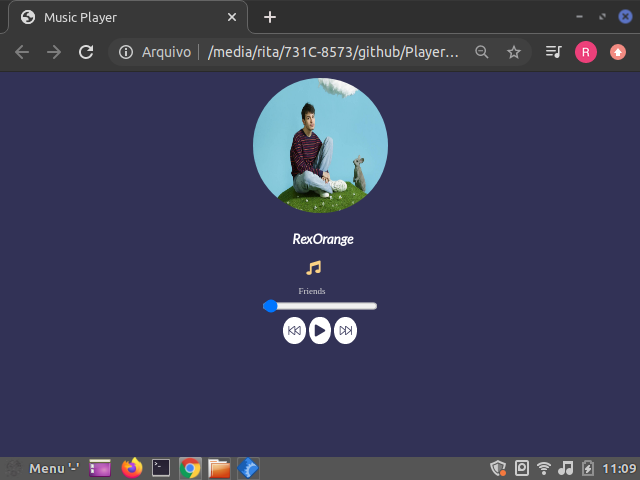

# About project:


I understand more about manipulating the DOM and this project was made to test this knowledge. It is a music player, which serves to listen to songs already placed in the project, but nothing prevents it from being done in the future by consuming an api, I intend to test soon.

# Project images:

<center></center>
<center></center>
<center></center>
<center></center>

# Explanation project JS:

- First you need to get the ids that are declared in the HTML.

```
var author = document.querySelector("#author");
var music = document.querySelector("#music");
var image = document.querySelector("#image");
var play = document.querySelector("#play");
var inputDuration = document.querySelector("#inputDuration");
```
- Right after that, it is necessary to declare some variables that will be necessary for the program logic when called in future functions.

```
// Necessary to know which music file the user is in.
let index_no = 0;

// It is necessary, in the future, to know how long the music is playing.
let time;

// Necessary in the play and pause function, as this variable is responsible for saying if the audio is playing and if it is can be paused, if it is not it can be started
let playing_song = false;

// Creates an html element with the audio tag so that we can manipulate the audio.
let track = document.createElement('audio');

```
- Now we declare the array containing the song data, such as the author's name, the file where the song is located, the author's image and the name of the song.

```
const All_songs = [
	{
		track_music: "nightcall",
		img: "image/Kavinsky.jpg",
		path: "music/nightcall.mp3",
		name_author: "Kavinsky"

	},

	{
		track_music: "Friends",
		img: "image/RexOrange.jpg",
		path: "music/friends.mp3",
		name_author: "RexOrange"
	}
];
```
**At the moment there are only two songs, but a lot more can be added.**

- Now we start with the necessary functions for the music to run perfectly.

<center><h1> Functions: </h1 </center>

- The first function is to start the audio, but it still does not play it, it starts every time the page is opened in position 0, that is, the first element will be placed on the screen with its data.

```
function load_track(index_no) {
  // Here we use the element that we created earlier, in this action we add a source for the element and now it has something to run.
	track.src = All_songs[index_no].path;

  // Loads the track, but does not start it.
	track.load();

  // Now, in the position you put in index_no, we take the image of the specific author of the song.
	image.src = All_songs[index_no].img;

  // Now we manipulate with DOM, the element capturing the past by id and so we add in it a new text which is the name of the author
	author.innerHTML = All_songs[index_no].name_author;

  // Similar to the previous item, it just changes that we put a text with the name of the song coming from the array in the index_no position.
	music.innerHTML = All_songs[index_no].track_music;

  // Set the position the user wants to listen to the music.
	time = setInterval(RangeSlider, 1000);
}
```

**At this point, we can call the function by passing the parameter expected by it. In this case, it is the variable declared with the value 0, index_no.**

```
load_track(index_no);
```

Every time the page renders the function data will appear at position 0 of the array All_songs[].

- Now we need to create the function that checks if the player is turned off, so that we can turn it on, otherwise, turn it off.

```
function JustPlay() {
	// Checks whether the playing_song variable is false, that is, if the player is turned off.
	if (playing_song == false) {
		// If it is, it calls the PlaySong function to turn it on.
		PlaySong();
	}else {
		// If it is already on, call the PauseSong function, to turn it off.
		PauseSong();
	}
}
```

- After calling these functions in the function above, we need to create them.
<br />
- [x] **PLaySong();**

```
function PlaySong() {
	// Starts music audio.
	track.play();
	// Changes the value of the variable to true.
	playing_song = true;
	// Creates an html with a start icon
	play.innerHTML = '<i class="fas fa-pause"></i>'
}
```
- [x] **PauseSong();**

```
function PauseSong() {
	// Pause music audio.
	track.pause();
	// Changes the value of the variable to false.
	playing_song = false;
	// Create an html with a pause icon.
	play.innerHTML = '<i class="fas fa-play"></i>'
}
```
- With all these steps already done, we already have the song starting and pausing, now we need it to come back one song or go to the next one.
<br />
- [x] **Next();**

```
function Next() {
	// If the index_no variable is less than the size of array -1, that is, the current position, it will take action.
	if (index_no < All_songs.length - 1) {
		// Add 1 to the variable.
		index_no += 1;

		// Passes the variable with the addition of +1 to the load_track function as a parameter.
		load_track(index_no);

		// Starts the song.
		PlaySong();
	}else {
		// Otherwise, pass 0 to the variable and it goes to the starting position.
		index_no = 0;
		load_track(index_no);
		PlaySong();
	}
}
```
- [x] **Return();**

```
function Return() {
	// If the index_no is greater than 0 it will perform an action of decrementing 1.
	if (index_no > 0) {
		index_no -= 1;
		load_track(index_no)
		PlaySong();
	}else{
		// Otherwise, it will move to the last position.
		index_no = All_songs.length;
		load_track(index_no);
		PlaySong();
	}
}
```
